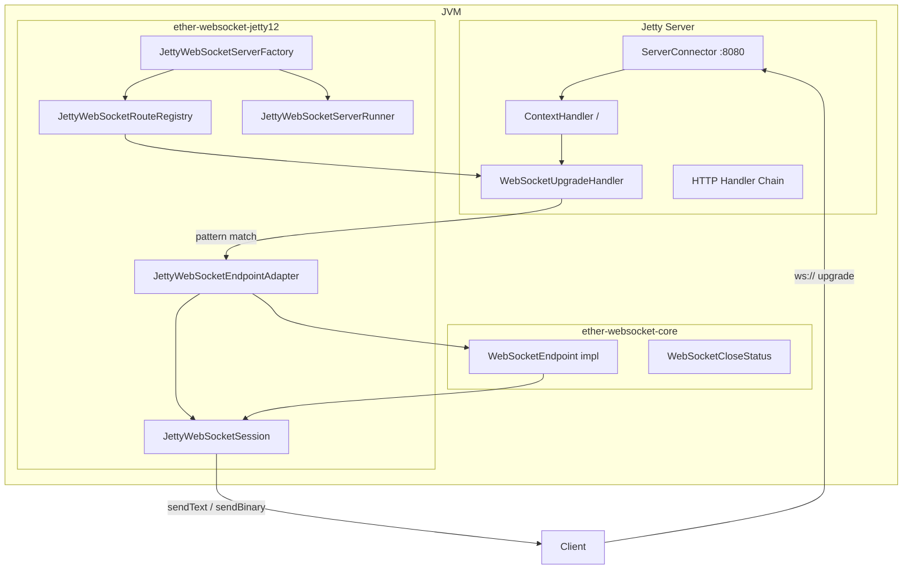

# ether-websocket-jetty12

Jetty 12 transport adapter for `ether-websocket-core`. Handles the HTTP upgrade, path-variable extraction, query-parameter decoding, header collection, subprotocol negotiation, and bridges every event into the `WebSocketEndpoint` / `WebSocketSession` contracts. Can run on the same Jetty server instance as `ether-http-jetty12`, sharing the thread pool.

## Coordinates

```xml
<dependency>
    <groupId>dev.rafex.ether.websocket</groupId>
    <artifactId>ether-websocket-jetty12</artifactId>
    <version>8.0.0-SNAPSHOT</version>
</dependency>
```

Transitive runtime dependencies pulled in automatically:

```xml
<!-- Included via ether-websocket-jetty12 -->
<dependency>
    <groupId>dev.rafex.ether.websocket</groupId>
    <artifactId>ether-websocket-core</artifactId>
</dependency>
<dependency>
    <groupId>org.eclipse.jetty</groupId>
    <artifactId>jetty-server</artifactId>
</dependency>
<dependency>
    <groupId>org.eclipse.jetty.websocket</groupId>
    <artifactId>jetty-websocket-jetty-api</artifactId>
</dependency>
<dependency>
    <groupId>org.eclipse.jetty.websocket</groupId>
    <artifactId>jetty-websocket-jetty-server</artifactId>
</dependency>
```

---

## Component overview

| Class | Role |
|---|---|
| `JettyWebSocketServerConfig` | Port, thread-pool sizing, and idle-timeout settings — loaded from env vars or constructed directly |
| `JettyWebSocketServerFactory` | Creates and wires the Jetty `Server`, `ServerConnector`, `WebSocketUpgradeHandler`, and route mappings |
| `JettyWebSocketServerRunner` | Thin wrapper around `org.eclipse.jetty.server.Server` exposing `start()`, `join()`, `stop()` |
| `JettyWebSocketRouteRegistry` | Mutable list of `WebSocketRoute` registrations, used during server construction |
| `JettyWebSocketModule` | Optional interface for grouping route registrations by feature |
| `JettyWebSocketModuleContext` | Context object passed to modules (holds config) |
| `JettyWebSocketSession` | Implements `WebSocketSession` on top of a Jetty `org.eclipse.jetty.websocket.api.Session` |
| `JettyWebSocketEndpointAdapter` | Jetty `@WebSocket`-annotated class that bridges Jetty callbacks to `WebSocketEndpoint` |

---

## Architecture: HTTP + WebSocket on one Jetty server



---

## Configuration

`JettyWebSocketServerConfig` is a record with these fields:

| Field | Env variable | Default |
|---|---|---|
| `port` | `HTTP_PORT` | `8080` |
| `minThreads` | `HTTP_MIN_THREADS` | `4` |
| `maxThreads` | `HTTP_MAX_THREADS` | `32` |
| `idleTimeoutMs` | `HTTP_IDLE_TIMEOUT_MS` | `30000` |
| `threadPoolName` | `HTTP_POOL_NAME` | `"ether-websocket"` |

```java
// Load from environment (12-factor style)
var config = JettyWebSocketServerConfig.fromEnv();

// Or construct directly
var config = new JettyWebSocketServerConfig(
    9090,   // port
    4,      // minThreads
    64,     // maxThreads
    60_000, // idleTimeoutMs
    "my-ws-pool"
);
```

---

## Starting a standalone WebSocket server

### Example: minimal setup

```java
package com.example;

import dev.rafex.ether.websocket.core.*;
import dev.rafex.ether.websocket.jetty12.*;
import java.util.logging.Logger;

public final class App {

    public static void main(String[] args) throws Exception {
        var config = JettyWebSocketServerConfig.fromEnv();

        var registry = new JettyWebSocketRouteRegistry();
        registry.add("/ws/echo", new EchoEndpoint());
        registry.add("/ws/chat/{room}", new ChatRoomEndpoint());

        var runner = JettyWebSocketServerFactory.create(config, registry);
        runner.start();

        System.out.println("WebSocket server running on port " + config.port());
        runner.join(); // blocks until server stops
    }
}
```

### Example: register multiple endpoints

```java
var registry = new JettyWebSocketRouteRegistry();

// Static path — exact match
registry.add("/ws/echo", new EchoEndpoint());

// Dynamic path — {room} extracted into session.pathParam("room")
registry.add("/ws/chat/{room}", new ChatRoomEndpoint());

// Wildcard — matches anything not matched above
registry.add("/**", new FallbackEndpoint());

var runner = JettyWebSocketServerFactory.create(config, registry);
runner.start();
```

---

## Module pattern

`JettyWebSocketModule` groups related route registrations behind a domain boundary:

```java
package com.example.chat;

import dev.rafex.ether.websocket.jetty12.*;

public final class ChatModule implements JettyWebSocketModule {

    private final ChatRoomEndpoint chatEndpoint;
    private final PresenceEndpoint presenceEndpoint;

    public ChatModule(ChatRoomEndpoint chatEndpoint, PresenceEndpoint presenceEndpoint) {
        this.chatEndpoint = chatEndpoint;
        this.presenceEndpoint = presenceEndpoint;
    }

    @Override
    public void registerRoutes(JettyWebSocketRouteRegistry routes,
                               JettyWebSocketModuleContext context) {
        routes.add("/ws/chat/{room}", chatEndpoint);
        routes.add("/ws/presence",   presenceEndpoint);
    }
}
```

Passing modules to the factory:

```java
var runner = JettyWebSocketServerFactory.create(
    config,
    List.of(
        new ChatModule(chatEndpoint, presenceEndpoint),
        new NotificationsModule(notificationEndpoint)
    )
);
runner.start();
```

---

## Broadcast to multiple sessions

`JettyWebSocketSession` is thread-safe for concurrent sends. Maintain a session registry in your endpoint and iterate over open sessions:

```java
package com.example.ws;

import dev.rafex.ether.websocket.core.*;
import java.util.Set;
import java.util.concurrent.ConcurrentHashMap;

public final class BroadcastEndpoint implements WebSocketEndpoint {

    // In a real service, scope this to a room or topic
    private final Set<WebSocketSession> connected = ConcurrentHashMap.newKeySet();

    @Override
    public void onOpen(WebSocketSession session) {
        connected.add(session);
    }

    @Override
    public void onClose(WebSocketSession session, WebSocketCloseStatus closeStatus) {
        connected.remove(session);
    }

    @Override
    public void onError(WebSocketSession session, Throwable error) {
        connected.remove(session);
    }

    @Override
    public void onText(WebSocketSession session, String message) {
        broadcastAll(message);
    }

    /**
     * Send a message to every connected session. Skips sessions that closed
     * between the check and the send (the transport drops those silently).
     */
    public void broadcastAll(String message) {
        for (var session : connected) {
            if (session.isOpen()) {
                session.sendText(message)
                       .exceptionally(ex -> {
                           connected.remove(session);
                           return null;
                       });
            }
        }
    }
}
```

External broadcast (e.g. from a scheduled job or HTTP handler):

```java
// Inject the endpoint into your HTTP handler
public final class AnnouncementHandler {

    private final BroadcastEndpoint broadcast;

    public AnnouncementHandler(BroadcastEndpoint broadcast) {
        this.broadcast = broadcast;
    }

    public void handle(HttpExchange exchange) throws Exception {
        var message = exchange.body(); // read body as String
        broadcast.broadcastAll(message);
        exchange.noContent();
    }
}
```

---

## Combined HTTP + WebSocket on the same Jetty instance

The most common production setup. `JettyWebSocketServerFactory` creates a standalone WebSocket-capable server. When you also have `ether-http-jetty12`, you can share the underlying Jetty `Server` object via `JettyWebSocketServerRunner.server()` to add additional handlers.

```java
package com.example;

import dev.rafex.ether.websocket.jetty12.*;
import org.eclipse.jetty.server.*;
import org.eclipse.jetty.server.handler.*;

public final class CombinedServer {

    public static void main(String[] args) throws Exception {
        var config = JettyWebSocketServerConfig.fromEnv();

        // Register WebSocket routes
        var registry = new JettyWebSocketRouteRegistry();
        registry.add("/ws/echo", new EchoEndpoint());
        registry.add("/ws/chat/{room}", new ChatRoomEndpoint());

        // Build the WebSocket-capable Jetty server
        var wsRunner = JettyWebSocketServerFactory.create(config, registry);

        // Retrieve the underlying Jetty Server and add an HTTP handler
        var jettyServer = wsRunner.server();
        var httpHandler = buildHttpHandler(); // your ether-http-jetty12 handler
        var sequence = new Handler.Sequence(jettyServer.getHandler(), httpHandler);
        jettyServer.setHandler(sequence);

        wsRunner.start();
        System.out.println("Combined HTTP + WebSocket server on port " + config.port());
        wsRunner.join();
    }

    private static Handler buildHttpHandler() {
        // Return your ether-http-jetty12 handler or any Jetty Handler
        return new Handler.Abstract() {
            @Override
            public boolean handle(Request request, Response response, Callback callback) {
                response.setStatus(200);
                response.write(true, java.nio.ByteBuffer.wrap("ok".getBytes()), callback);
                return true;
            }
        };
    }
}
```

---

## JettyWebSocketSession internals

`JettyWebSocketSession` is the Jetty implementation of `WebSocketSession`. Key implementation details:

- `id()` — derived from `System.identityHashCode(jettySession)` formatted as hex; unique within the JVM process.
- `attributes` — backed by a `ConcurrentHashMap`; safe to read and write from multiple threads.
- `sendText` / `sendBinary` — delegate to Jetty's async `Session.sendText` / `sendBinary` with a `CompletableFuture`-based callback; never blocks the calling thread.
- `close` — delegates to Jetty's `Session.close(code, reason, callback)`.
- `pathParams`, `queryParams`, `headers` — all collected at upgrade time and stored as unmodifiable maps; Jetty's URL-decoding utilities handle query parameters.

---

## Subprotocol negotiation

`JettyWebSocketServerFactory` automatically negotiates subprotocols by checking the client's offered protocols against the set returned by `WebSocketEndpoint.subprotocols()`:

```java
public final class MsgpackEndpoint implements WebSocketEndpoint {

    @Override
    public Set<String> subprotocols() {
        return Set.of("msgpack", "json");
    }

    @Override
    public void onOpen(WebSocketSession session) {
        var negotiated = session.subprotocol();
        // Use "msgpack" or "json" based on what was negotiated
    }
}
```

---

## License

MIT License — Copyright (c) 2025–2026 Raúl Eduardo González Argote
